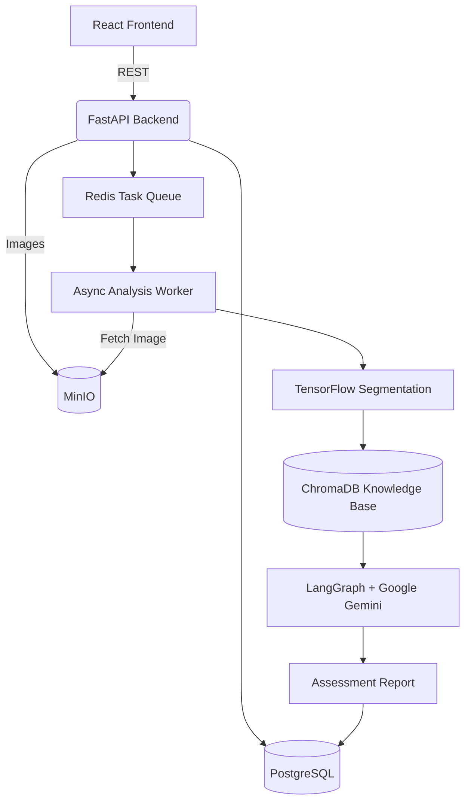

# CivilCortex

CivilCortex is an AI-powered civil engineering inspection system designed to ingest drone imagery or field photography of physical infrastructure (buildings, bridges, etc.) and automatically classify and assess structural defects. Utilizing computer vision for spatial metrics and localized LangGraph evaluation paths, CivilCortex acts as an assistant to human engineers by generating standardized, standard-compliant repair recommendations.

## 🏗️ Architecture

CivilCortex runs on a fully isolated multi-tenant architecture:

- **Frontend**: React (Vite) + TailwindCSS, providing a responsive UI for multi-tenant organizations with strict role-based access control (Admin, Engineer, Inspector).
- **Backend API**: FastAPI (Python), utilizing SQLAlchemy with PostgreSQL for deeply nested structural hierarchies (`Building` -> `Floor` -> `Area` -> `StructuralElement` -> `Defect`).
- **Object Storage**: MinIO for scalable, local/cloud-agnostic persistence of high-resolution inspection imagery.
- **Asynchronous Task Queue**: Redis + RQ for orchestrating background ML pipelines without blocking the primary web threads.
- **Machine Learning (CV)**: TensorFlow/Keras semantic segmentation for identifying structural defects (e.g., concrete cracks, spalling) and calculating spatial severity metrics.
- **AI Agentic Evaluation (LLM)**: LangGraph state machines integrating RAG (ChromaDB) to map defect severity against localized civil engineering regulatory standards, producing structured Markdown engineering reports via Google Gemini.

### System Diagram



## 📊 Current Project State (Phase 21 Handover)

The system has undergone extensive 21-phase implementation and auditing. The capabilities of the current system are strictly classified as follows:

### ✅ Verified Capabilities (Fully Tested & Demonstrated)
- **Multi-Tenant RBAC Security**: Organizations are perfectly isolated. IDOR (Insecure Direct Object Reference) vectors across deeply nested hierarchy elements (`Building` -> `Inspection` -> `Image` -> `Defect`) are mitigated and validated by the backend E2E integration suite.
- **Asynchronous Inference Pipeline**: The RQ-backed worker correctly manages idempotency. Overlapping analysis requests yield the active job status rather than duplicating processing. Job states transition deterministically (`QUEUED`, `PROCESSING`, `COMPLETED`, `FAILED`).
- **API & Upload Hardening**: Uploads are restricted by precise MIME types and arbitrarily generated UUID object keys to eliminate path traversal risks. Endpoints enforcing pagination bounds completely eliminate massive N+1 query execution and DoS exhaustion vectors.
- **LangGraph Evaluation Paths**: The structured AI contracts successfully transition Computer Vision outputs into LangGraph workflows, which execute dynamically and deterministically.

### 🟡 Environment-Limited Capabilities
These capabilities are dependent on external service connections which may not be present in every local deployment environment. The codebase contains robust fallback and localized mock handling for these exact constraints:
- **Local MinIO Availability**: Full binary blob transmission tests are occasionally skipped if the Docker daemon running MinIO is unreachable, falling back to local Python `StorageError` handling.
- **Google Gemini Rate Limiting**: The system successfully catches Google's strict 15-request-per-minute free tier limits, gracefully intercepting `429 Too Many Requests` into a structured, readable report warning instead of crashing the worker thread.
- **Redis Requirement**: Some asynchronous tests explicitly mock the worker queue to pass without requiring a localized `redis-server` running on the host machine.

### 🔴 Unknown / Not Validated (Awaiting Domain Certification)
Do not deploy CivilCortex to replace licensed structural engineering without resolving these points:
- **Real-World ML Accuracy**: The semantic segmentation models rely on naive probability thresholds (e.g., `> 0.5`) and bounds checking. Real-world accuracy (IoU / Dice Coefficients) remains unverified in the absence of a comprehensive, labeled testing dataset.
- **Engineering Severity Matrix**: The core mapping of spatial pixel widths into regulatory severity classes (e.g., "High Risk") utilizes heuristic mappings. These rules have **not** been physically certified by an accredited civil engineer.

## 🚀 Setup & Deployment

### Prerequisites
- Docker & Docker Compose
- Node.js (v18+) for frontend compilation
- Python 3.9+ for backend development

### Configuration
1. Clone the repository.
2. In the `backend` directory, duplicate the environment template:
   ```bash
   cp .env.example .env
   ```
3. Open `.env` and fill in the required variables (specifically `GEMINI_API_KEY`, and replace dummy passwords for `POSTGRES_PASSWORD` and `MINIO_ROOT_PASSWORD` with secure strings).

### Running via Docker Compose
CivilCortex is containerized for seamless local deployment. The provided compose file boots the database, Redis, MinIO, Backend, and Frontend.

1. At the repository root, build and start the containers:
   ```bash
   docker-compose up --build
   ```
2. The application will be available at:
   - **Frontend UI**: `http://localhost:80`
   - **Backend API Docs (Swagger)**: `http://localhost:8000/docs`
   - **MinIO Console**: `http://localhost:9001` (Use the credentials you defined in `.env`)

### Local Development Setup
To run the components bare-metal for development:

**Backend**:
```bash
cd backend
python -m venv .venv
source .venv/bin/activate
pip install -r requirements.txt
uvicorn app.main:app --reload
```

**Frontend**:
```bash
cd frontend
npm install
npm run dev
```

## 🛠️ Testing
The backend is verified by a 68-test regression suite encompassing unit, integration, and End-to-End security validations.

To run the suite:
```bash
cd backend
PYTHONPATH=. pytest tests/ -v
```
